# Počítačové videnie - úloha 2

**Autor: Martin Šváb**

## Vstup

Tento obrázok je použitý ako vstup vo všetkých nasledujúcich úlohách. 

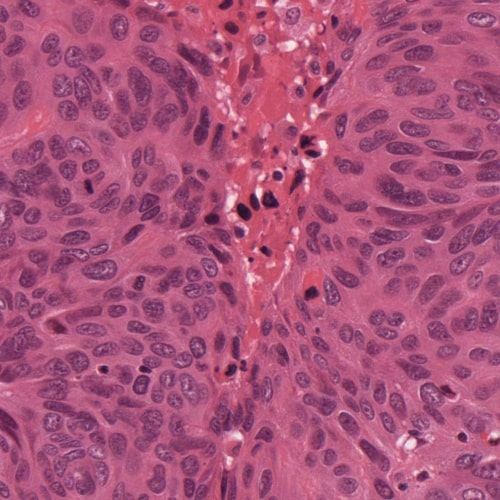

## Histogram

Pri všetkých experimentoch s normalizáciou histogramov používame totožný algoritmus. Najskôr konvertujeme vstupný obrázok do nášho zvoleného farebného priestoru. Kanály konvertovaného obrázka rozdelíme a individuálne na nich vykonáme histogramovu equalizáciu. Upravenné kanály spojíme a získame tak výstupný obrázok, ktorý spätne konvertujeme do BGR farebného priestoru. z kanálov pôvodného aj upraveného obrázka vypočítame a zobrazíme histogramy. 

	void histogram(cv::Mat input, cv::ColorConversionCodes conversion, cv::ColorConversionCodes inverseConversion,
		std::vector<std::string> channelNames, std::vector<cv::Scalar> colors, bool corrections[], const float* ranges[], OutputArgs outputArgs)
	{
		// convert image from bgr to different color space
		cv::Mat converted;
		cv::cvtColor(input, converted, conversion);
		outputImage(converted, outputArgs);
	
		// split image channels
		std::vector<cv::Mat> channels;
		cv::split(converted, channels);
		int channelCount = channels.size();
	
		// correct channels with histogram equalization
		std::vector<cv::Mat> channelsCorrected(channelCount);
		for (int i = 0; i < channelCount; i++) {
			if (corrections[i])
				cv::equalizeHist(channels[i], channelsCorrected[i]);
			else
				channelsCorrected[i] = channels[i];
		}
	
		// merge corrected channels
		cv::Mat corrected;
		cv::merge(channelsCorrected, corrected);
	
		// display histogram of original image
		std::vector<cv::Mat> hist(channelCount);
		calcHist(channels, hist, ranges);
		displayHist(hist, colors, channelNames, { "hist_" + outputArgs.name, outputArgs.dir, outputArgs.extension });
	
		// display histogram of corrected image
		std::vector<cv::Mat> histCorrected(channelCount);
		calcHist(channelsCorrected, histCorrected, ranges);
		displayHist(histCorrected, colors, channelNames, { "hist_" + outputArgs.name + "_corrected", outputArgs.dir, outputArgs.extension });
	
		// display corrected image
		cv::Mat output;
		cv::cvtColor(corrected, output, inverseConversion);
		outputImage(output, { outputArgs.name + "_corrected", outputArgs.dir, outputArgs.extension });
	
		cv::waitKey();
	}

### Histogram - Grayscale

Vstupný a výstupný histogram:

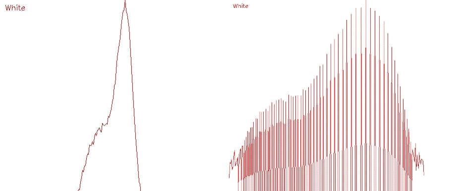

Vstupný a výstupný obrázok:

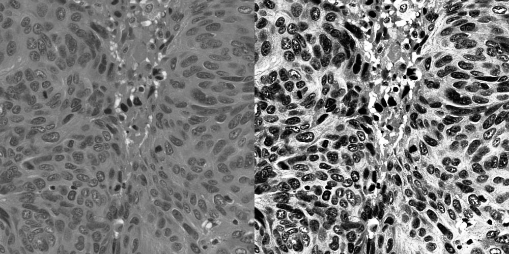

### Histogram - HSV

Vstupný a výstupný histogram:

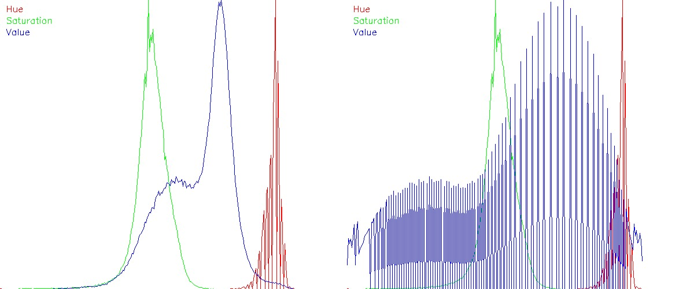

Vstupný a výstupný obrázok:

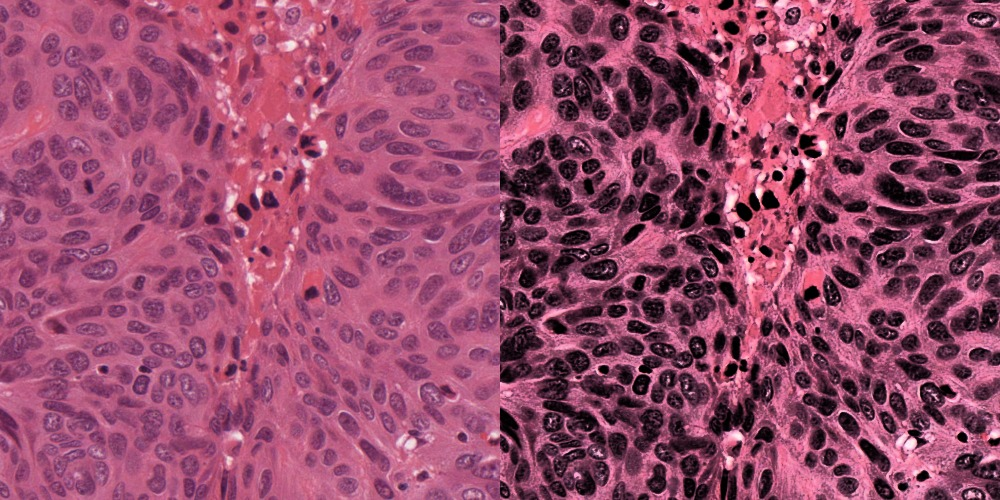

### Histogram - LAB

Vstupný a výstupný histogram:

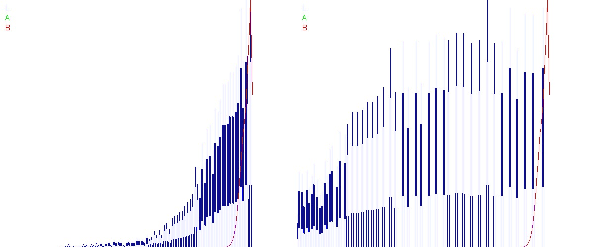

Vstupný a výstupný obrázok:

### Histogram - RGB

Vstupný a výstupný histogram:

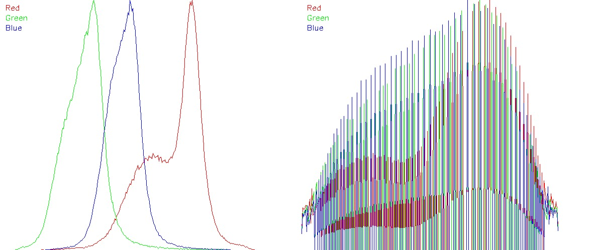

Vstupný a výstupný obrázok:

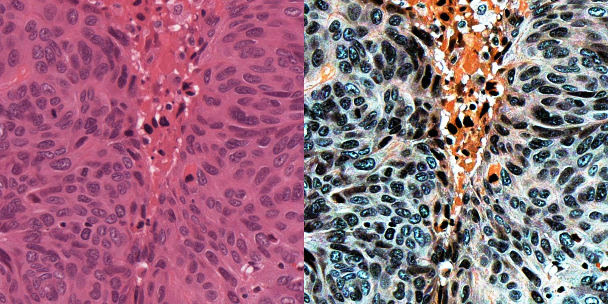

### Histogram - XYZ

Vstupný a výstupný histogram:

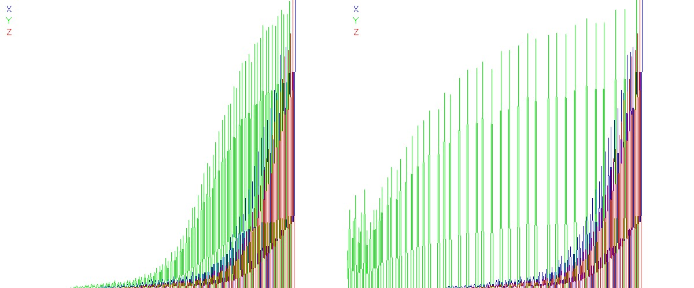

Vstupný a výstupný obrázok:

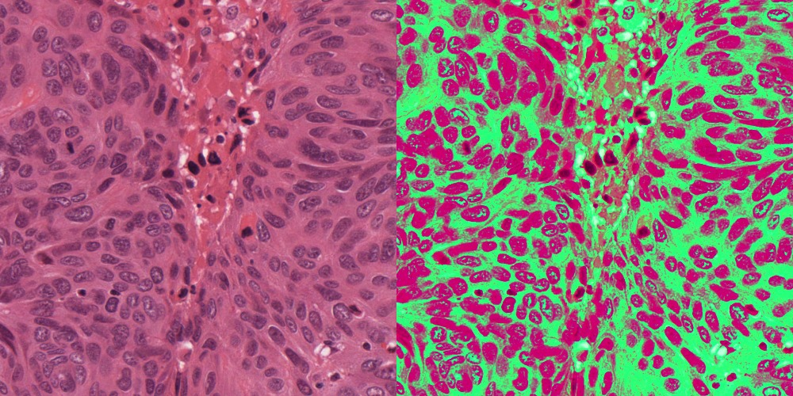

### Histogram - YCrCb

Vstupný a výstupný histogram:

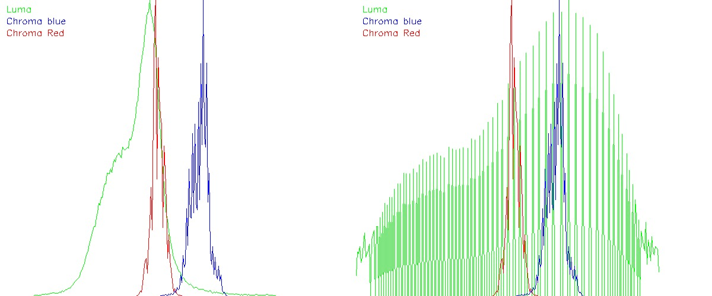

Vstupný a výstupný obrázok:

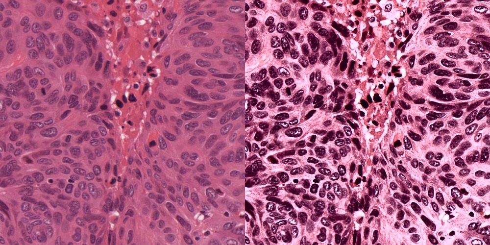

## Gamma

S rôznymi hodnotami gamma sme vykonali gamma korekciu vstupného obrázku. Hodnoty obrázku sme po korekcii znormalizovali. Experiment sme vykonali pre 4 rôzne hodnoty gamma [-0.5; 0,.5; 1.5; 2.5] (pre všetky výsledky si pozrite súbory v priečinku output/gamma/).

	void gammaCorrection(cv::Mat input, std::vector<double> gammas)
	{
		std::string outputDir = "output\\gamma\\";
		std::string outputExtension = ".png";
	
		cv::Mat converted = input;
		input.convertTo(converted, CV_32F);
	
		for (int gammaID = 0; gammaID < gammas.size(); gammaID++)
		{
			double gamma = gammas[gammaID];
			std::string outputName = "gamma" + std::to_string(gammaID);
	
			cv::Mat corrected;
			cv::pow(converted, gamma, corrected);
	
			cv::Mat normalized;
			cv::normalize(corrected, normalized, 0, 255, cv::NORM_MINMAX);
	
			cv::Mat output;
			normalized.convertTo(output, CV_8U);
	
			outputImage(output, { outputName, outputDir, outputExtension });
		}
	
		cv::waitKey();
	}

Vstupný a výstupný obrázok [gamma = 1.5]:

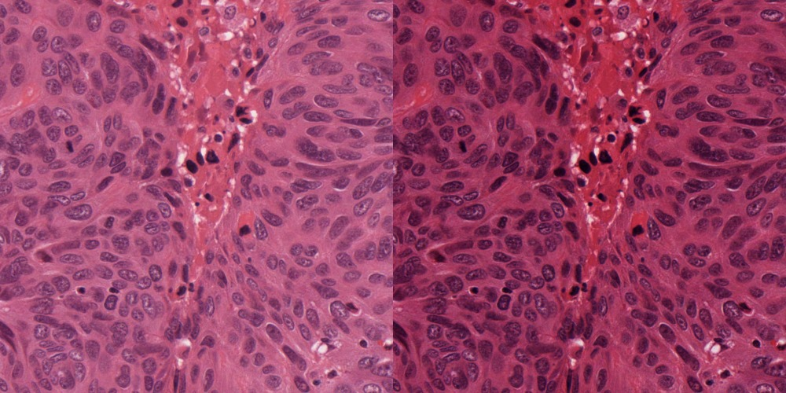

## CDF

V tomto experimente využívame na korekciu farby distribučnú funkciu. Najskôr konvertujeme vstupný a cieľový obrázok do našej zvolenej farebnej schémy. Z konvertovaných obrázkov vypočítame histogramy. Z histogramov vypočítame cdf. Zo vstupnej a cieľovej cdf vypočítame lookup tabuľku. Pomocou tejto tabuľky premapujeme farby na vstupnom obrázku. Tento obrázok prekonvertujeme späť do BGR farebnej schémy a získame výstupný obrázok.

	void cdf(cv::Mat input, cv::Mat target, cv::ColorConversionCodes conversion, cv::ColorConversionCodes inverseConversion,
		std::vector<std::string> channelNames, std::vector<cv::Scalar> colors, const float* ranges[], OutputArgs outputArgs)
	{
		// convert images from bgr to different color space
	
		cv::Mat convertedInput;
		cv::cvtColor(input, convertedInput, conversion);
		outputImage(convertedInput, { outputArgs.name + "_input", outputArgs.dir, outputArgs.extension});
	
		cv::Mat convertedTarget;
		cv::cvtColor(target, convertedTarget, conversion);
		outputImage(convertedTarget, { outputArgs.name + "_target", outputArgs.dir, outputArgs.extension });
	
		// split image channels
	
		std::vector<cv::Mat> inputChannels;
		cv::split(convertedInput, inputChannels);
	
		std::vector<cv::Mat> targetChannels;
		cv::split(convertedTarget, targetChannels);
	
		int channelCount = inputChannels.size();
	
		// calculate histograms
	
		std::vector<cv::Mat> inputHist(channelCount);
		calcHist(inputChannels, inputHist, ranges);
		displayHist(inputHist, colors, channelNames, { "hist_" + outputArgs.name + "_input", outputArgs.dir, outputArgs.extension });
	
		std::vector<cv::Mat> targetHist(channelCount);
		calcHist(targetChannels, targetHist, ranges);
		displayHist(targetHist, colors, channelNames, { "hist_" + outputArgs.name + "_target", outputArgs.dir, outputArgs.extension });
	
		// calculate cdf
	
		std::vector<cv::Mat> inputCDF(channelCount);
		calcCDF(inputHist, inputCDF);
		displayCDF(inputCDF, colors, channelNames, { "cdf_" + outputArgs.name + "_input", outputArgs.dir, outputArgs.extension });
	
		std::vector<cv::Mat> targetCDF(channelCount);
		calcCDF(targetHist, targetCDF);
		displayCDF(targetCDF, colors, channelNames, { "cdf_" + outputArgs.name + "_target", outputArgs.dir, outputArgs.extension });
	
		// calculate lookup table
		
		std::vector<cv::Mat> lookUpTable;
		for (int channelID = 0; channelID < channelCount; channelID++) {
			cv::Mat lut(1, 256, CV_8U);
			lookUpTable.push_back(lut);
		}
	
		calcLookUpTable(inputCDF, targetCDF, lookUpTable);
	
		// correct image
	
		std::vector<cv::Mat> correctedChannels(channelCount);
		for (int channelID = 0; channelID < channelCount; channelID++)
			cv::LUT(inputChannels[channelID], lookUpTable[channelID], correctedChannels[channelID]);
	
		cv::Mat corrected;
		cv::merge(correctedChannels, corrected);
	
		// display image
	
		cv::Mat output;
		cv::cvtColor(corrected, output, inverseConversion);
		outputImage(output, { outputArgs.name + "_corrected", outputArgs.dir, outputArgs.extension });
	
		cv::waitKey();
	}

Vstupný a cieľový obrázok:

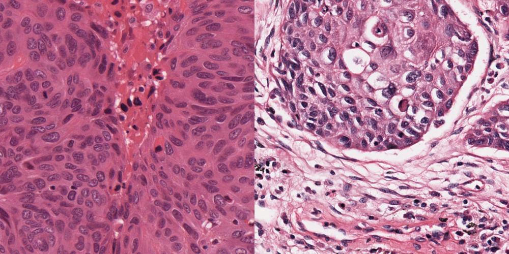

### RGB

Vstupný a cieľový histogram:

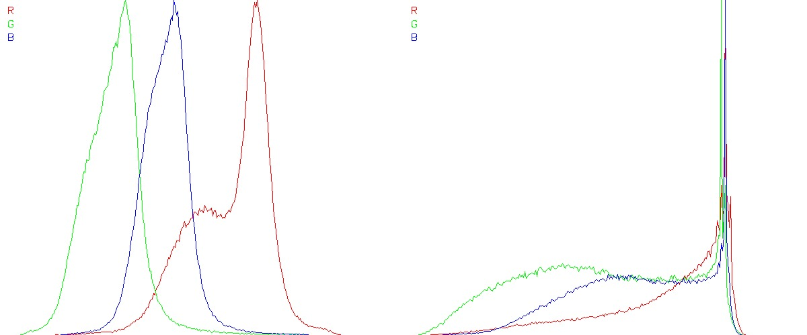

Vstupné a cieľové cdf:

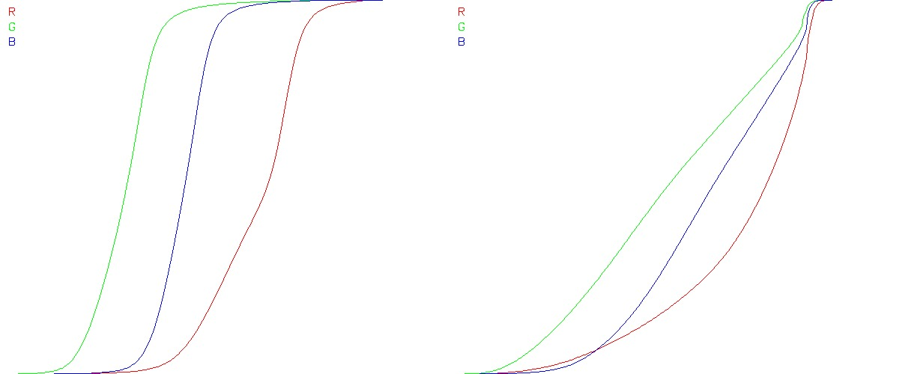

Výstupný obrázok:

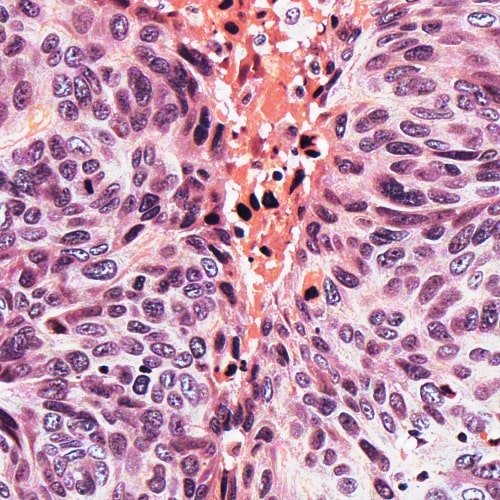

### YCC

Vstupný a cieľový histogram:

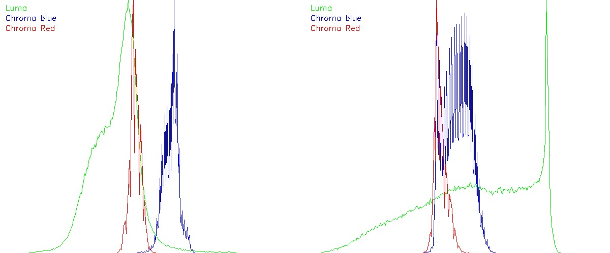

Vstupné a cieľové cdf:

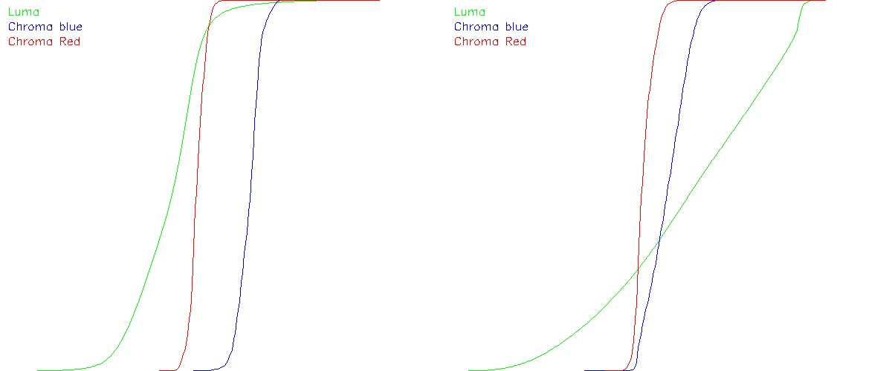

Výstupný obrázok:

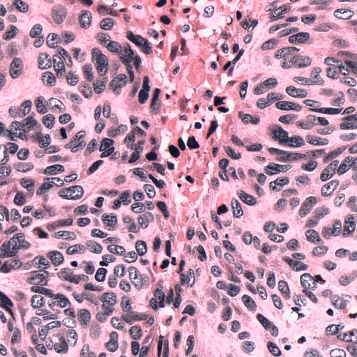

## Segmentácia

V tomto experimente konvertujeme vstupný obrázok do Lab farebného priestoru. Kanály konvertovaného obrázka rozdelíme a vypočítaním priemeru s použitím masky nukleidu získame cieľové kanály. Pomocu vstupných a cieľových kanálov vypočítame delta lab. Na delta lab obrázku vykonáme binárny thresholding s hodnotou 30. Takto získame masku všetkých nukleidov. Aplikovaním tejto masky získame výstupný obrázok, kde vidíme vysegmentované nukleidy.

	void segmentation(cv::Mat input, cv::Mat mask)
	{
		std::string outputDir = "output\\segmentation\\";
		std::string outputExtension = ".png";
	
		// convert to lab color space
	
		cv::Mat inputLab;
		cv::cvtColor(input, inputLab, cv::COLOR_BGR2Lab);
		outputImage(inputLab, { "input_lab", outputDir, outputExtension });
	
		// split channels
	
		std::vector<cv::Mat> inputChannels;
		cv::split(inputLab, inputChannels);
		int channelCount = inputChannels.size();
	
		// compute target
	
		std::vector<cv::Scalar> targetChannels(channelCount);
		for (int channelID = 0; channelID < channelCount; channelID++)
			targetChannels[channelID] = cv::mean(inputChannels[channelID], mask);
	
		// compute delta lab
	
		cv::Mat delta_l, delta_a, delta_b;
		cv::absdiff(inputChannels[0], targetChannels[0], delta_l);
		cv::absdiff(inputChannels[1], targetChannels[1], delta_a);
		cv::absdiff(inputChannels[2], targetChannels[2], delta_b);
	
		delta_l.convertTo(delta_l, CV_32F);
		delta_a.convertTo(delta_a, CV_32F);
		delta_b.convertTo(delta_b, CV_32F);
	
		cv::Mat delta_lab;
		cv::sqrt(delta_l.mul(delta_l) + delta_a.mul(delta_a) + delta_b.mul(delta_b), delta_lab);
		delta_lab.convertTo(delta_lab, CV_8U);
		outputImage(delta_lab, { "delta_lab", outputDir, outputExtension });
	
		// perform thresholding
	
		cv::Mat threshold;
		cv::threshold(delta_lab, threshold, 30, 255, cv::THRESH_BINARY);
		outputImage(threshold, { "threshold", outputDir, outputExtension });
		threshold.convertTo(threshold, CV_8U);
	
		// display output
	
		cv::Mat output;
		input.copyTo(output, threshold);
		outputImage(output, { "output", outputDir, outputExtension });
	
		cv::waitKey();
	}

Maska pre nukleid:

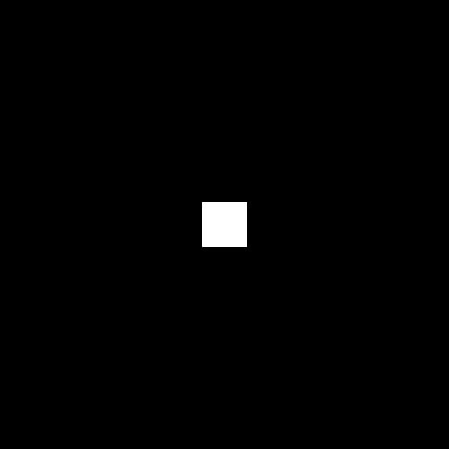

Delta lab a jeho threshold:

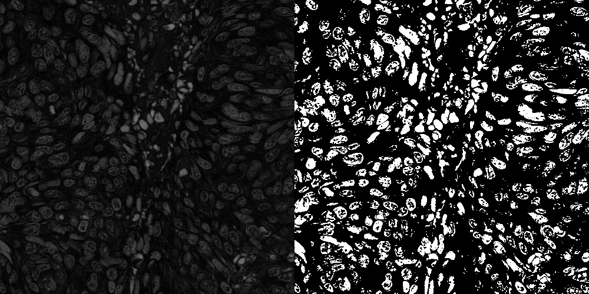

Vstupný a výstupný obrázok:

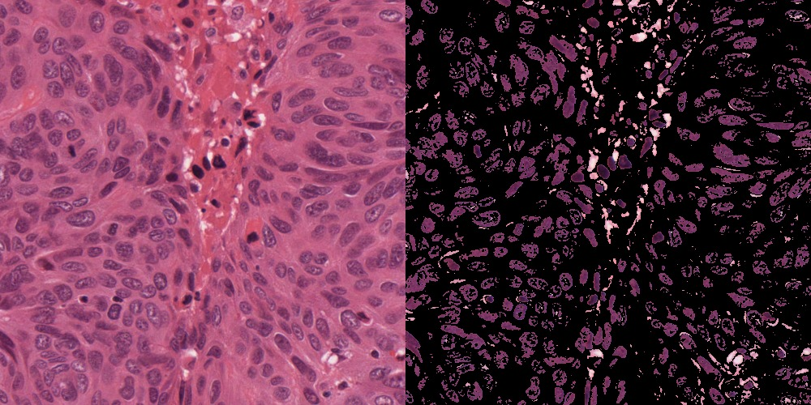
